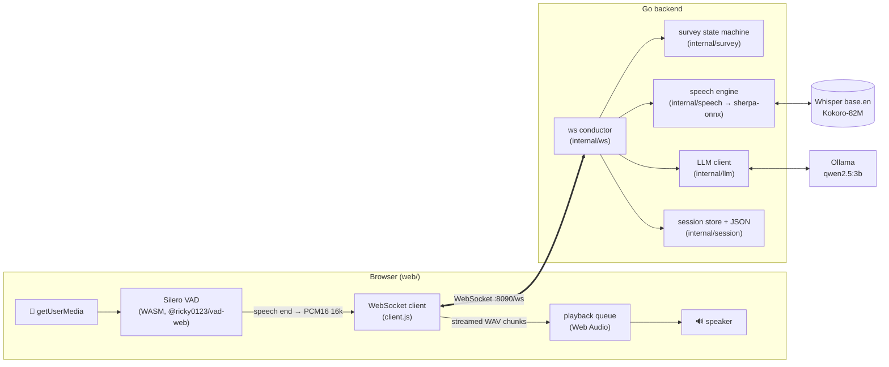
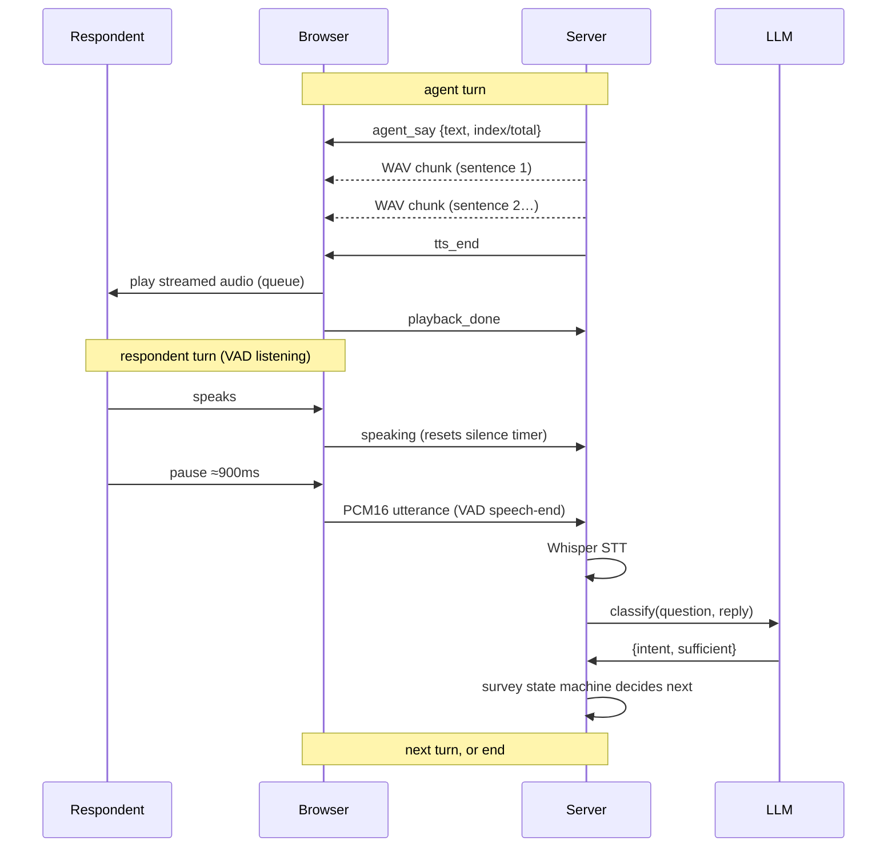
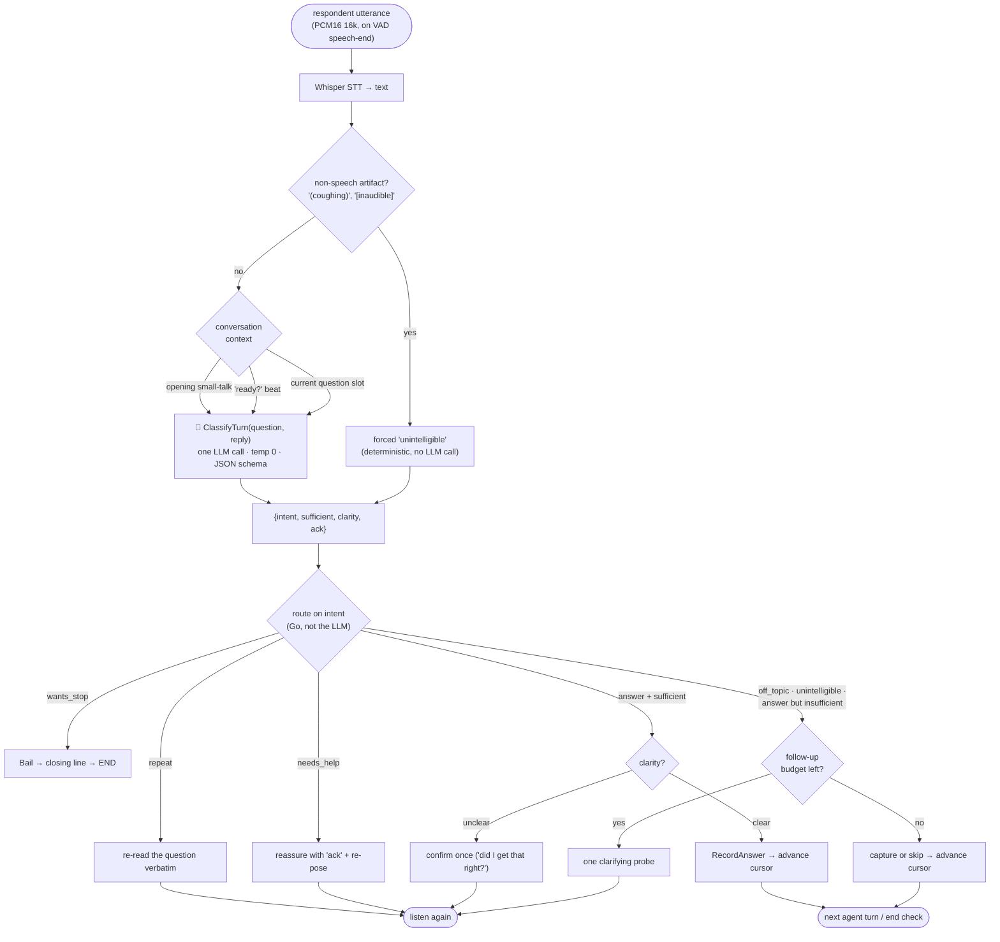
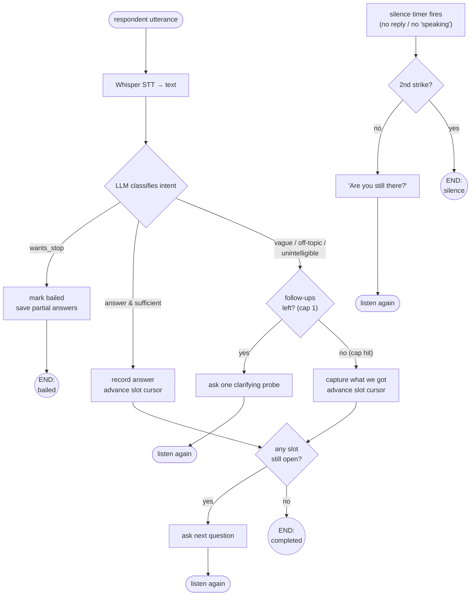
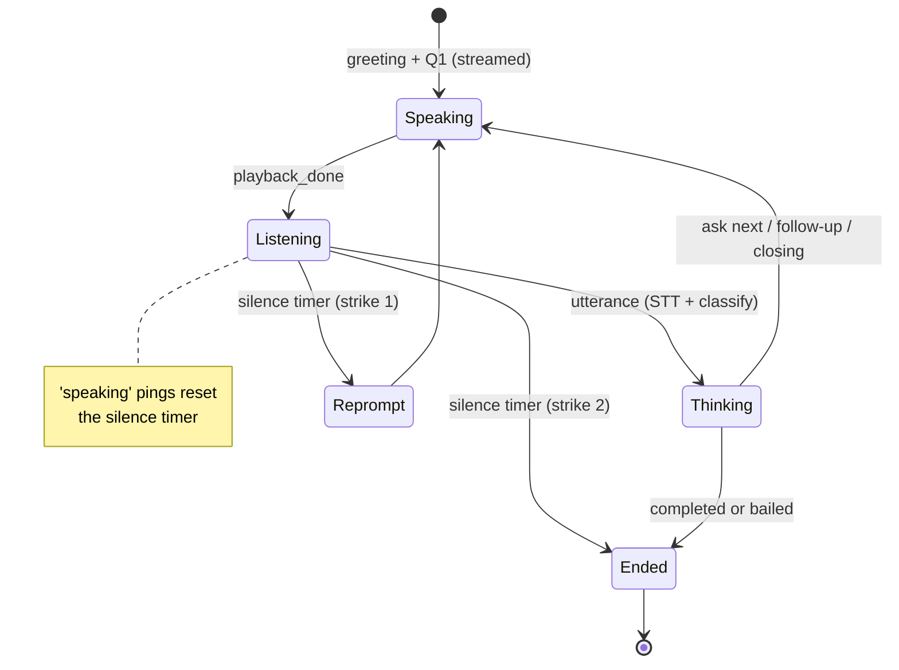

# Architecture

A browser voice agent that walks a respondent through an AI-generated opinion
poll and **decides on its own when the conversation is over**. Everything runs
locally — no cloud STT/TTS.

- **Frontend** (`web/`): mic capture + Silero VAD (endpointing) + streamed TTS
  playback, over one WebSocket. Vanilla JS.
- **Backend** (Go): a WebSocket **conductor** that owns the conversation, a
  **survey state machine** that owns the ending, local **STT/TTS** (sherpa-onnx:
  Whisper + Kokoro), and a small **LLM** (Ollama `qwen2.5:3b`) for question
  generation and per-turn intent classification.

---

## 1. Components

**Server is authoritative.** The browser only captures speech and plays audio;
every decision (what to say, when to listen, when to end) is made server-side.

---

## 2. One conversational turn

TTS is **streamed sentence-by-sentence** so the first words play almost
immediately instead of waiting for the whole reply to synthesize.

---

## 3. Every utterance goes through intent analysis

There is exactly **one** way into the conversation logic: whatever the respondent
says is transcribed, labeled by the classifier, and then routed by Go code. The
greeting, the "ready?" beat, and every question slot all funnel through the same
`ClassifyTurn` with the same prompt — so "actually, I don't have time" ends the
call at hello just as reliably as it does on question four.

The classifier reads the turn on **two axes**: `intent` (what they're doing) and
`clarity` (whether we pinned down the content). Clarity is what triggers a light
repair on a valid-but-hard-to-parse answer instead of throwing it away.

| Intent | Agent does | Slot cursor |
|---|---|---|
| `answer` + sufficient | acknowledge and move on (or confirm once if `unclear`) | advances |
| `answer`, insufficient | one gentle probe, then capture what it got | advances after the probe |
| `wants_stop` | closing line, hang up | — (ends) |
| `repeat` | re-read the question as-is | stays |
| `needs_help` | reassure + hint how to answer, re-pose the question | stays |
| `off_topic` | steer back once, then **skip** (never fabricate an answer) | advances after the probe |
| `unintelligible` | same as off-topic — probe once, then skip | advances after the probe |

Three properties make this safe to run unattended:

- **The LLM labels; it never acts.** Every branch above is a Go `if` in
  `internal/ws`. There is no tool the model can call to hang up, skip a
  question, or re-ask — see [`RESEARCH.md`](RESEARCH.md) for why that matters.
- **It fails open.** A classifier timeout or unparseable JSON degrades to
  `{answer, sufficient, clear}`, so a model glitch advances the survey instead
  of stalling it.
- **Every "stay put" branch is capped.** `repeat` and `needs_help` share a
  re-ask budget, probes are capped per question, and a repair happens at most
  once per slot — so no intent can hold the conversation on one question.

---

## 4. How it knows when to end  ⭐

The core design decision (validated by the research in
[`RESEARCH.md`](RESEARCH.md)): **an LLM cannot reliably feel when a scripted
conversation is "done."** So a deterministic **slot state machine** owns the
ending — the LLM only classifies each reply. The survey ends for exactly one of
three reasons.

### The three ways it ends

| End reason | Trigger | Owned by |
|---|---|---|
| **completed** | every question slot answered or skipped | state machine (`survey`) |
| **bailed** | a reply classified `wants_stop` ("I have to go") | LLM classifier → state machine |
| **silence** | no reply for `silenceWindow`, twice in a row | server timer (`ws` conductor) |

Two guardrails keep it from misbehaving:

- **Follow-up cap (1 per question).** A vague or off-topic answer earns exactly
  one clarifying probe; after that the agent captures whatever it got and moves
  on — so it can never loop forever on one question.
- **The `speaking` keep-alive.** The silence timer measures *quiet time*, not
  *time since listening began*. While the respondent is talking the browser
  pings `speaking`, which resets the timer — so a long, pause-filled answer
  never trips the "still there?" nudge.

### Conversation states

---

## 5. WebSocket protocol

Text frames = JSON control; binary frames = audio (PCM16 in, WAV chunks out).

**Client → Server**

| message | meaning |
|---|---|
| `{"type":"ready"}` | page loaded, mic granted |
| `{"type":"speaking"}` | respondent is talking now (resets silence timer) |
| `{"type":"playback_done"}` | agent audio finished; safe to listen |
| `{"type":"barge_in"}` | user talked over the agent (barge-in mode) |
| *(binary)* | PCM16 mono 16 kHz utterance (on VAD speech-end) |

**Server → Client**

| message | meaning |
|---|---|
| `{"type":"agent_say", text, kind, index, total}` | new agent turn (caption + progress) |
| *(binary)* | a WAV sentence chunk for the current turn |
| `{"type":"tts_end"}` | no more audio chunks this turn |
| `{"type":"transcript", text}` | what STT heard |
| `{"type":"cancel"}` | stop/clear playback (barge-in ack) |
| `{"type":"done", reason}` | ended: `completed` \| `bailed` \| `silence` |

Each new WebSocket connection **starts a fresh run** of the same poll, so
reloading `/poll/<id>` re-takes it (used by the Restart button).

---

## 6. Tuning knobs

| Knob | Where | Default | Effect |
|---|---|---|---|
| `redemptionFrames` | `client.js` (VAD) | 28 (~900 ms) | trailing silence before a turn is "done"; raise if it cuts people off |
| `silenceWindow` | `ws.go` | 12 s | how long to wait before the "still there?" nudge |
| `maxSilenceStrikes` | `ws.go` | 2 | nudges before ending on silence |
| `maxFollowUps` | `survey.go` | 1 | clarifying probes per question |
| Kokoro voice id | `speech.go` | 0 | agent voice |

See [`VALIDATION.md`](../VALIDATION.md) for how every layer is tested.
