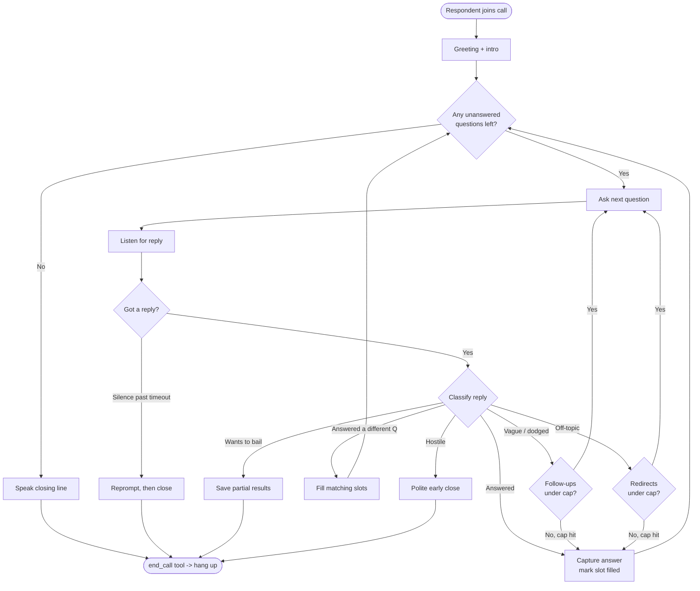
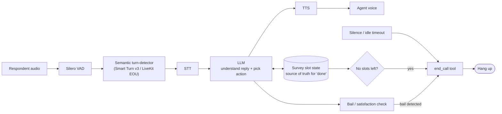

# How to Make a Voice AI Agent Know When to End the Conversation

Research brief for a voice AI agent that walks a user through a sequence of
questions but cannot decide on its own when the conversation is complete and
should be terminated (hang up / end session).

> **Method:** deep multi-agent web research — 105 agents, 23 sources fetched,
> 106 candidate claims extracted, 25 adversarially verified (3-vote, need 2/3
> to kill). Result: **24 confirmed, 1 refuted.** Compiled 2026-07-21.

---

## TL;DR — the key finding

**There is no "conversation-is-done" model in production. Nobody has one.**

Across every major framework and the research literature, termination is split
into distinct layers, and the "is the goal satisfied?" judgment is *deliberately*
not left to a magic detector.

One claim was explicitly **refuted 0-3 by adversarial verification**: that a
prompt-engineered LLM agent can *reliably* self-detect when its programmed goal
is achieved.

So if the current approach is "let the LLM decide in its head when it's done,"
that is the confirmed failure mode — and the fix is **architectural, not a
better prompt**.

The problem decomposes into **three separate things**, each with a different
solution, plus one adjacent trap.

---

## Applied: the conversational survey / poll agent

**Product context:** a platform where customers build voice-driven opinion
polls. A customer (say, a candle seller) defines a list of questions; poll
respondents get a link, talk to a voice agent, and the agent walks them through
all the questions as a natural conversation.

### The reframe: this is mostly NOT a detection problem

Because **the customer defines the exact list of questions upfront**, the
conversation has a *known, finite* endpoint. That is the opposite of the
open-ended case most of this research hedges against.

The refuted claim ("an LLM can reliably self-detect when it's done") was about
open-ended goals. A poll does not have an open-ended goal — it has a
**checklist**. So the agent should not *feel* its way to the end; it should
**track which questions are still unanswered and end when the list is
exhausted.**

Plainly: *stop asking the LLM "are we done?" — track survey state and the answer
is deterministic.*

This is the classic **slot-filling / form-filling** pattern. Each poll question
is a slot. The survey is done when every required slot is filled (or explicitly
skipped).

### Mental model: a survey state machine with an LLM front-end

```
Survey state (per session):
  questions = [Q1, Q2, Q3, ...]   <- defined by the candle seller
  each question: { status: unasked | asked | answered | skipped,
                   answer: <captured text/rating> }

The LLM's job each turn is NOT to decide "is the conversation over."
Its job is: understand the reply -> update slot(s) -> pick the next action.
```

The LLM handles naturalness (phrasing, follow-ups, acknowledgements). The
**state machine owns the ending.**

### The per-question loop (this is where the "interactions in the middle" live)

For the *current* question, each user reply is classified into one of:

1. **Answered sufficiently** -> capture it, advance to next unanswered question.
2. **Vague / dodged** ("it's fine, I guess") -> *one* clarifying probe, then move
   on regardless. **Cap follow-ups at 1-2** or the agent loops forever — the
   classic failure mode for conversational surveys.
3. **Answered a *different* question** (user volunteers Q3 info while on Q1) ->
   mark both slots filled, skip Q3 later. Good polls dedupe like this.
4. **Off-topic / rambling** -> brief redirect back to the current question, also
   capped.

When step 1 leaves **no unanswered questions -> transition to closing.**

### Termination logic: one happy path, three early exits

- **Happy path (the ~95% case):** last slot filled -> agent speaks a closing
  line ("That's everything — thanks so much for your thoughts on the candles!")
  -> fires the `end_call` tool. Deterministic. No ML needed.
- **Early exit A — user wants to bail:** "I have to go," "I'm done," hangs up
  mid-way. Detect with a lightweight intent check (small classifier or a cheap
  supervisor-LLM flag). Save partial results, thank them, end gracefully. Do
  *not* force them through remaining questions.
- **Early exit B — silence/idle backstop:** user goes quiet. Escalating reprompt
  ("Are you still there?") -> after N seconds, close and hang up. Pure timeout,
  no ML.
- **Early exit C — hostile / abusive:** end politely and early.

All four paths converge on the same `end_call` tool — the difference is only
*what triggers* it and whether results are marked complete vs. partial.

### Survey flow (the loop + all termination paths)



### Concrete building blocks that fit this shape

- **Pipecat Flows** — a node-based conversation state machine built for
  structured multi-step flows like intake forms and surveys; likely the closest
  off-the-shelf fit (each question = a node with an advance condition).
  *Verify current capabilities in Pipecat docs — this research verified Pipecat's
  turn-detection, not Flows specifically.*
- **LiveKit Agents** — the verified `end_call` tool + multi-step workflows.
- **Turn-taking layer** (Smart Turn v3 / LiveKit EOU + Silero VAD) — matters a
  lot here, because respondents pause mid-thought ("I like the scent... but...").
  Plain silence-VAD will cut them off and corrupt answers. See section 4.
- **Per-question sufficiency + early-bail detection** — a single cheap LLM call
  per turn, or a small classifier trained on BETOLD/USS-style data at scale.

### What to tell the team

The "agent doesn't know when to stop" bug is almost certainly because **there is
no explicit survey-progress state** — the LLM is being asked to hold the whole
checklist in its head and intuit completion. Give it:

1. Explicit per-question slot state (the source of truth for "done").
2. A capped per-question follow-up loop (kills infinite probing).
3. An `end_call` tool triggered by "no slots left," plus early-exit and silence
   backstops.

That turns a fuzzy, unreliable judgment into a deterministic one.

---

## 1. The termination *action* — an explicit `end_call` tool

Every production framework does the same thing: give the LLM a dedicated tool it
invokes to hang up. This is the single most directly applicable pattern.

- **LiveKit Agents** ships a prebuilt `EndCallTool` — the LLM gets an `end_call`
  function, used "when the conversation is complete." It first speaks a final
  `end_instructions`-driven goodbye, then shuts down the session gracefully.
  <https://docs.livekit.io/agents/prebuilt/tools/end-call-tool/>

- **Vapi** exposes a built-in `endCall` default tool (`{"type":"endCall"}`),
  surfaced afterward as ended-reason `assistant-ended-call`.
  <https://docs.vapi.ai/tools/default-tools>

- **Apple's ToolSandbox** (research) gives its user-simulator exactly *one* tool,
  `end_conversation`, fired when the task "has been completed, or could not be
  completed." They report that offering this single isolated tool measurably
  improved termination behavior.
  <https://arxiv.org/html/2408.04682v2>

**Takeaway:** if the agent has no explicit end/hangup tool, it literally cannot
end — it can only keep talking. A minimal, isolated termination action improves
reliability.

---

## 2. Deterministic backstops — timeouts and phrases

Never trust the LLM alone. Because the LLM won't always fire the tool,
production systems layer hard, non-ML backstops:

- **Silence/idle timeout** — Vapi's `silenceTimeoutSeconds` → ended-reason
  `silence-timed-out`.
- **End-call phrase** — a configured phrase that force-ends the call
  (`assistant-said-end-call-phrase`).
- **Escalating idle messages** — chained speech-timeout hooks (e.g. 10s/20s/30s)
  that end with a farewell + `endCall`.

Sources:
<https://docs.vapi.ai/calls/call-ended-reason> ·
<https://docs.vapi.ai/assistants/idle-messages>

These are the safety net so a scripted agent never hangs forever.

---

## 3. The *judgment* — split into "script done" vs. "user wants to bail"

This is the actual hard part, and it is two different questions.

### (a) "The script finished successfully" — treat it as explicit state

- Use **prompt-as-control-flow / Conversation Routines** (arXiv 2501.11613):
  the system prompt defines explicit sequential stages
  (Initial Assessment -> Procedure -> Completion). Matches a question-sequence
  agent exactly. <https://arxiv.org/html/2501.11613v3>

- **But** back it with a **dialogue-state / slot-filling completeness check** or
  a **supervisor / judge LLM** that classifies "all required slots filled ->
  done." Do *not* rely on the primary LLM's self-assessment — that is the
  refuted claim (see Refuted section below).

### (b) "The user wants to bail early" — this is a trainable classifier

Real datasets exist:

- **BETOLD** (COLING 2022) — 13,524 real human-agent phone dialogues,
  ~33% breakdowns, where breakdown = user "cannot or does not want to proceed."
  Privacy-preserving: works on intent/entity signals, not raw text.
  Paper: <https://aclanthology.org/2022.cai-1.4/>
  Repo: `telepathylabsai/BETOLD_dataset`

- **USS (User Satisfaction Simulation)** — 6,800 dialogues, 5-level satisfaction
  labels across JDDC / SGD / MultiWOZ / ReDial / CCPE, with baseline classifiers
  (`train_sat.py` / `train_act.py`) ready to train.
  <https://github.com/sunnweiwei/user-satisfaction-simulation>

- **SPUR** (ACL 2024) — LLM extracts SAT/DSAT rubrics, applies them to unseen
  conversations, beats embedding baselines USDA/ASAP (e.g. Bing Copilot F1 77.4
  vs 57.0 / 41.0), interpretable. Caveat: single self-benchmark, strongest in
  low-data regimes, costly at scale.
  <https://arxiv.org/html/2403.12388v1>

---

## 4. The adjacent trap — end-of-*turn* is NOT end-of-*conversation*

Part of "the agent doesn't know when to stop" is often premature/late
**turn-taking** — knowing when the *user* stopped speaking. This is a *solved*
problem with mature open-source models. Layer one over plain VAD.

| Model | Type | Latency | License | Link |
|---|---|---|---|---|
| **Pipecat Smart Turn v3** | raw waveform (Whisper-tiny enc.) | ~12ms best-case CPU (60-95ms cheap CPU, 3.3ms GPU) | BSD-2 | <https://huggingface.co/pipecat-ai/smart-turn-v3> |
| **Smart Turn v2** | raw waveform (Wav2Vec2) | CPU-viable | BSD-2 | <https://huggingface.co/pipecat-ai/smart-turn-v2> |
| **LiveKit turn-detector / EOU** | transcript-based, semantic | CPU-only (INT8 ONNX) | open | <https://huggingface.co/livekit/turn-detector> |

- LiveKit's EOU is a **Qwen2.5-0.5B-Instruct** fine-tune, distilled from a 7B
  teacher, reading `<|im_end|>` probability over up to 6 turns / 128 tokens.
  Runs alongside Silero VAD, not instead of it. They also built a 135M
  SmolLM2-based variant.
  <https://blog.livekit.io/using-a-transformer-to-improve-end-of-turn-detection>

- Smart Turn repo: <https://github.com/pipecat-ai/smart-turn>

**Academic roots** if they want to train their own:

- **TurnGPT** — GPT-2-style LM predicting turn-shift probability per token.
  <https://arxiv.org/abs/2010.10874>
- **Voice Activity Projection (VAP)** — real-time continuous turn-taking from
  stereo audio. <https://arxiv.org/abs/2401.04868>
  Repos: `ErikEkstedt/VoiceActivityProjection`, `MaAI-Kyoto/MaAI`

---

## Recommended stack for a scripted-questions agent

1. **Model the script as explicit state** (slots/stages), not LLM intuition.
   Conversation-Routines-style staged prompt.
2. **Normal completion:** deterministic check "all required slots filled" ->
   agent fires an explicit `end_call` tool that speaks a goodbye, then hangs up.
3. **Early bail-out:** a lightweight supervisor LLM or a BETOLD/USS-style
   breakdown/satisfaction classifier running in parallel, watching for
   disengagement -> triggers the same `end_call`.
4. **Backstops:** silence/idle timeout + end-call phrase so it never hangs
   forever.
5. **Turn-taking layer:** Silero VAD + a semantic turn-detector (Smart Turn v3
   or LiveKit EOU) so it doesn't confuse "user paused" with "user finished."

### Layered architecture



The audio layer decides *when the respondent finished speaking*; the dialogue
layer decides *what to do with the answer and what's left*; the termination
control decides *when to hang up*. Only the state machine (not the LLM's gut
feeling) authoritatively answers "is the survey done."

---

## Refuted claim (killed by adversarial verification, 0-3)

> "LLM agents built with a prompt-engineering framework can reliably recognize
> when a conversation's programmed goal has been achieved, i.e. detect
> task/goal completion, without a dedicated classifier."

Source it was drawn from: <https://arxiv.org/html/2501.11613v3>
Implication: use a dedicated completion classifier / supervisor check rather
than trusting the primary LLM's self-assessment.

---

## Caveats

- Vendor docs (Vapi, LiveKit) are authoritative for their own features but are
  product docs, not neutral benchmarks — config keys change; verify against
  current docs before building.
- The satisfaction/breakdown datasets (USS, BETOLD, SPUR) are from text / phone
  task-oriented dialogue, adjacent to but not identical to real-time voice
  hangup. SPUR's superiority rests on a single self-benchmark, strongest in
  low-data regimes, costly at scale.
- Smart Turn's ~12ms figure is best-case on a high-end CPU.
- **Unconfirmed by this research:** Retell, Bland, Deepgram, ElevenLabs
  Conversational AI, Twilio, Speechmatics, Assembly, Krisp end-call/turn
  specifics — no claims survived verification for these. Worth a targeted
  follow-up if any is the actual platform in use.

---

## Open questions for follow-up

1. What concrete architecture reliably detects TASK/GOAL completion for a
   scripted question sequence — a supervisor/judge LLM classifying "all slots
   filled," a DST slot-filling completeness check, or a per-stage rubric — and
   how accurate/latent is each versus trusting the primary LLM's `end_call`
   decision?
2. How do the unverified vendors (Retell, Bland, Deepgram, ElevenLabs
   Conversational AI, Twilio) expose end-call tools, goal-completion signals,
   and idle timeouts? Do any offer automatic objective-satisfaction detection
   beyond a model-driven tool?
3. Can a distinguisher be built between "script finished successfully" vs.
   "user wants to bail early" — e.g. combining a BETOLD-style breakdown
   classifier with a slot-completion/supervisor check?
4. State of academic continuous turn-taking (TurnGPT, VAP) vs. productionized
   Smart Turn / LiveKit detectors in latency and accuracy — are pretrained VAP
   checkpoints readily usable?

---

## Full source list

All sources rated `primary` unless noted.

### Production / vendor (end-call mechanism)
- <https://docs.vapi.ai/tools/default-tools> — Vapi built-in `endCall` tool
- <https://docs.vapi.ai/calls/call-ended-reason> — Vapi ended-reason taxonomy
- <https://docs.vapi.ai/assistants/idle-messages> — Vapi idle/timeout escalation
- <https://docs.livekit.io/agents/prebuilt/tools/end-call-tool/> — LiveKit EndCallTool
- <https://docs.livekit.io/agents/voice-agent/function-calling/> — LiveKit tool-triggered speech

### LLM-based completion / supervisor detection
- <https://arxiv.org/html/2408.04682v2> — Apple ToolSandbox (`end_conversation` tool)
- <https://arxiv.org/html/2501.11613v3> — Conversation Routines (prompt-as-control-flow)
- <https://arxiv.org/pdf/2512.17843> — (LLM completion, supporting)
- <https://arxiv.org/html/2508.00454v4> — MTDEval (distilled multi-judge dialogue evaluator)

### Academic DST / dialogue termination / satisfaction
- <https://aclanthology.org/2022.cai-1.4/> — BETOLD breakdown-detection dataset
- <https://github.com/sunnweiwei/user-satisfaction-simulation> — USS dataset + baselines
- <https://arxiv.org/abs/2101.09374> — (DST / satisfaction)
- <https://arxiv.org/html/2403.12388v1> — SPUR (rubric-based satisfaction)

### Turn-taking / endpointing (end-of-turn)
- <https://huggingface.co/pipecat-ai/smart-turn-v2> — Smart Turn v2 (raw waveform)
- <https://huggingface.co/pipecat-ai/smart-turn-v3> — Smart Turn v3
- <https://github.com/pipecat-ai/smart-turn> — Smart Turn repo
- <https://huggingface.co/livekit/turn-detector> — LiveKit semantic EOU detector
- <https://blog.livekit.io/using-a-transformer-to-improve-end-of-turn-detection> — LiveKit EOU writeup
- <https://livekit.com/blog/turn-detection-voice-agents-vad-endpointing-model-based-detection> — LiveKit turn-detection overview (blog)

### Academic turn-taking prediction
- <https://arxiv.org/abs/2010.10874> — TurnGPT
- <https://arxiv.org/abs/2401.04868> — Voice Activity Projection (VAP), real-time
- <https://github.com/ErikEkstedt/VoiceActivityProjection> — VAP reference implementation
- <https://github.com/MaAI-Kyoto/MaAI> — MaAI turn-taking toolkit

### Additional dataset surfaced
- <https://huggingface.co/datasets/tucnguyen/ShareChat> — real in-the-wild user-chatbot conversations
